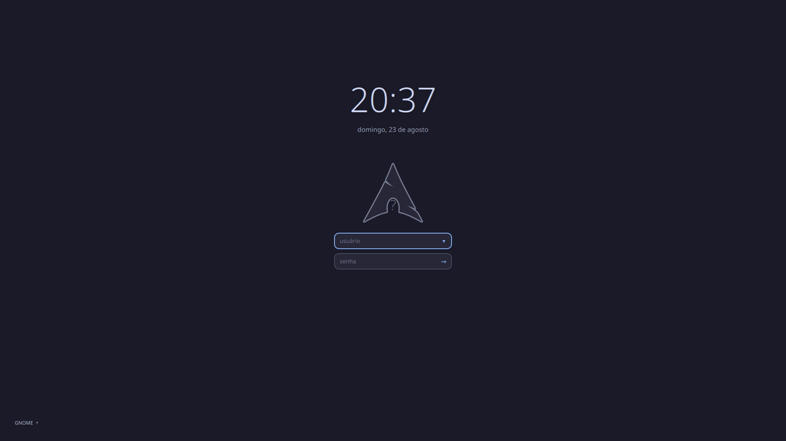

# Hypr Pallas

A minimal [SDDM](https://github.com/sddm/sddm) theme in
[Catppuccin Mocha](https://github.com/catppuccin/catppuccin), built to sit
visually next to [Hyprland](https://hyprland.org/).



No login button, no icon bar — just a clock, the user's picture cropped to the
Arch silhouette, two fields, and a quiet session selector in the corner.

## Design

Geometry mirrors Hyprland's own window decoration, so the greeter reads as part
of the same desktop:

| Theme | Hyprland |
|---|---|
| `radius: 12` | `decoration:rounding = 12` |
| `borderW: 2` | `general:border_size = 2` |
| focused border `#89b4fa` | `general:col.active_border` |
| idle border `#45475a` | `general:col.inactive_border` |

## Requirements

- `sddm` 0.21+
- `qt6-declarative` (provides `QtQuick` and `QtQuick.Effects`)

That is all. The theme imports only `QtQuick` and `QtQuick.Effects` and ships no
binaries — the only bundled assets are the two small PNG masks used by the
avatar.

## Install

```sh
git clone https://github.com/dantebertuzzi/hypr-pallas.git
sudo cp -r hypr-pallas /usr/share/sddm/themes/hypr-pallas
sudo mkdir -p /etc/sddm.conf.d
printf '[Theme]\nCurrent=hypr-pallas\n' | sudo tee /etc/sddm.conf.d/10-theme.conf
```

Preview it without rebooting:

```sh
sddm-greeter-qt6 --test-mode --theme /usr/share/sddm/themes/hypr-pallas
```

## Configuration

Edit `theme.conf` — no QML changes needed:

| Key | Default | Meaning |
|---|---|---|
| `background` | *(empty)* | Image path, relative to the theme folder. Empty falls back to a Mocha gradient. |
| `blurRadius` | `24` | Wallpaper blur. `0` disables. |
| `dimOpacity` | `0.62` | Darkening over the wallpaper, `0.0`–`1.0`. |
| `accent` | `#89b4fa` | Focused border, submit arrow, active session. |

### Using your own wallpaper

Drop the image into the theme folder and point `background` at it:

```ini
[General]
background=background.png
```

Put the file **inside the theme folder**, not in your home directory. The
greeter runs as the unprivileged `sddm` user, which usually cannot read a home
directory with `700` permissions.

## Note on `QtVersion`

`metadata.desktop` declares:

```ini
QtVersion=6
```

This matters more than it looks. SDDM ships two greeter binaries, and the daemon
picks one based on that key — [`ThemeMetadata.cpp`](https://github.com/sddm/sddm/blob/v0.21.0/src/common/ThemeMetadata.cpp):

```cpp
d->qtVersion = settings.value(QStringLiteral("SddmGreeterTheme/QtVersion"), 5).toInt();
```

**When the key is absent it defaults to 5**, and the daemon launches
`/usr/bin/sddm-greeter` (Qt5). On a Qt6-only system that binary fails to load
its libraries, `sddm-helper` exits with code `127`, and you get a black screen
at boot with no greeter at all.

If you adapt this theme, keep the key.

## Avatar

The user's picture is cropped to the Arch logo silhouette instead of the usual
circle. Two PNGs carry the shape:

| File | Role |
|---|---|
| `arch-mask.png` | Filled silhouette. Doubles as the `MultiEffect` mask (only its alpha channel matters) and as the placeholder behind the picture. |
| `arch-outline.png` | Ring around the silhouette, obtained by dilating the mask's alpha and subtracting the original. Tinted at runtime, so the colour is not baked into the file. |

Where the picture comes from, in order:

1. `/var/lib/AccountsService/icons/<user>` — what GNOME Settings writes when you
   set a profile picture
2. `/usr/share/sddm/faces/<user>.face.icon` — SDDM's own convention

SDDM's generic `.face.icon` is deliberately *not* in that list: cropped to the
silhouette it reads as a smudge. When no picture is found, the silhouette stays
filled and shows the first letter of the typed name instead.

The field reacts to typing, so the picture follows whichever user is entered.
At the login screen the field already comes filled with `userModel.lastUser`.

Under the software renderer `MultiEffect` draws nothing, so the crop and the
outline are skipped and the filled silhouette with the initial is shown.

## Session selector

The corner dropdown lists every session in `/usr/share/wayland-sessions` and
`/usr/share/xsessions`, and remembers the last one used via
`sessionModel.lastIndex`.

Worth checking after switching to any SDDM theme: many rice themes hide or omit
the session selector entirely, because their authors run a single desktop.

## Changelog and roadmap

Release notes live in [CHANGELOG.md](CHANGELOG.md); what is worth doing next,
and what deliberately is not, in [ROADMAP.md](ROADMAP.md).

## License

MIT — see [LICENSE](LICENSE).

The preview image shows the theme's default gradient. No wallpaper is bundled,
and the picture in it is the empty-field placeholder, not a real avatar.
